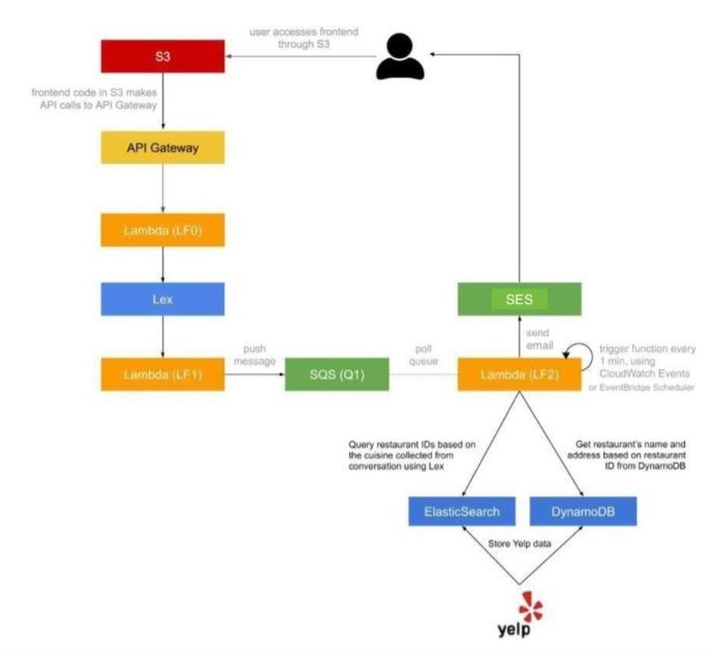

# Dining Concierge Bot

## Overview
This project is a scalable and serverless dining concierge application designed to provide intelligent, user-specific restaurant recommendations. It leverages event-driven architecture and various AWS services to ensure seamless performance and user experience.

## Features
- **Conversational Interface**: Integrated with Amazon Lex to enable advanced conversational capabilities.
- **Efficient Data Indexing**: Utilized Elasticsearch for scalable and efficient indexing of restaurant data.
- **Real-time Notifications**: Implemented Amazon SES for seamless real-time notification delivery.
- **Automated Cloud Infrastructure**: Provisioned cloud infrastructure using AWS Cloud Development Kit (CDK) and Python.

## Technologies Used
- **Front-end**: CSS (Bootstrap), JavaScript (jQuery, AWS SDK)
- **Back-end**: AWS Lambda, DynamoDB, Amazon Lex, Elasticsearch, Amazon SES
- **Infrastructure**: AWS Cloud Development Kit (CDK), Python

##  System Architecture

## Setup Instructions

### Prerequisites
- Node.js and npm installed
- AWS CLI configured with appropriate credentials
- Python installed

